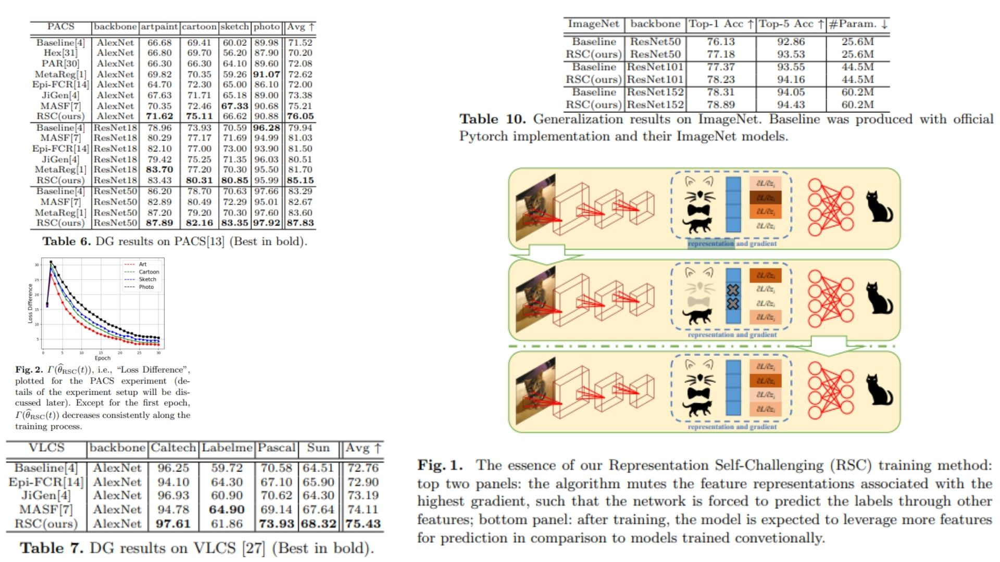

# 🌊 RSC-Replication – Robust Self-Challenging for CNNs

This repository provides a **PyTorch-based replication** of  
**RSC: Robust Self-Challenging for Convolutional Networks**.

The focus is **understanding and implementing RSC feature masking** in a clean, practical pipeline,  
rather than achieving state-of-the-art benchmark performance.

- Gradients identify top-activated features 🌟  
- Selectively mask dominant spatial or channel features 🔐  
- Encourages the network to learn **diverse feature representations** 🌀  

**Paper reference:** [RSC – Huang et al., 2020: Self-Challenging Improves Cross-Domain Generalization](https://arxiv.org/pdf/2007.02454) 🌿

---

## 🌠 Overview – RSC Pipeline



The core idea:

> Identify the most dominant features via gradients → mask them → forward a perturbed batch → encourage under-utilized features.

High-level procedure:

1. Extract features from a CNN backbone with an intermediate forward pass.  
2. Compute how the loss changes with respect to the features.
3. Generate a mask to suppress top-p spatial or channel features.  
4. Forward masked features through the remaining network.  
5. Update the model to learn **more robust and diverse representations**.  

This process can be applied **per batch** or **iteratively** during training.

---

## 🧮 Gradient-based Feature Masking

For spatial masking, feature gradients are aggregated across channels:

$$
g_{avg}^{(b,h,w)} = \frac{1}{C} \sum_{c=1}^C \frac{\partial L}{\partial F_{b,c,h,w}}
$$

For channel masking, gradients are averaged over spatial dimensions:

$$
g_{avg}^{(b,c)} = \frac{1}{H \cdot W} \sum_{h=1}^{H} \sum_{w=1}^{W} \frac{\partial L}{\partial F_{b,c,h,w}}
$$

The **mask** is computed by keeping only features below the top-p threshold:

$$
M = \mathbb{1}\big(g_{avg} < \text{quantile}(g_{avg}, 1-p)\big)
$$

Where $p$ is the fraction of features to suppress, $\mathbb{1}$ is the indicator function, and $F$ denotes the feature map.

---

## 🧠 What the Model Learns

- Suppresses dominant features, forcing the network to explore **under-utilized features**  
- Spatial or channel masking encourages **diverse feature learning**  
- Robustness to over-reliance on specific feature activations  
- Simple, effective, and **compatible with existing CNN architectures**

---

## 📦 Repository Structure

```bash
RSC-Replication/
├── src/
│   ├── layers/
│   │   ├── conv_layer.py          # Conv2d wrapper (RSC-safe, forward mask support)
│   │   ├── activation.py          # ReLU, GELU helpers
│   │   └── normalization.py       # Optional BatchNorm compatibility
│   │
│   ├── backbone/
│   │   └── resnet_blocks.py       # ResNet-style convolutional blocks
│   │
│   ├── model/
│   │   └── rsc_cnn.py             # CNN + RSC masking logic
│   │
│   ├── rsc/
│   │   ├── mask_generator.py      # Gradient-based top-$p$ mask computation
│   │   └── self_challenge.py      # Apply mask & perturbed forward pass
│   │
│   ├── loss/
│   │   └── classification_loss.py # Standard classification loss
│   │
│   ├── analysis/
│   │   └── feature_activation.py  # Visualize feature usage before/after RSC
│   │
│   └── config.py                  # Hyperparameters: $p$, batch %, learning rate
│
├── images/
│   └── figmix.jpg                 # RSC overview & feature activation example
│
├── requirements.txt
└── README.md
```
---


## 🔗 Feedback

For questions or feedback, contact: [barkin.adiguzel@gmail.com](mailto:barkin.adiguzel@gmail.com)
